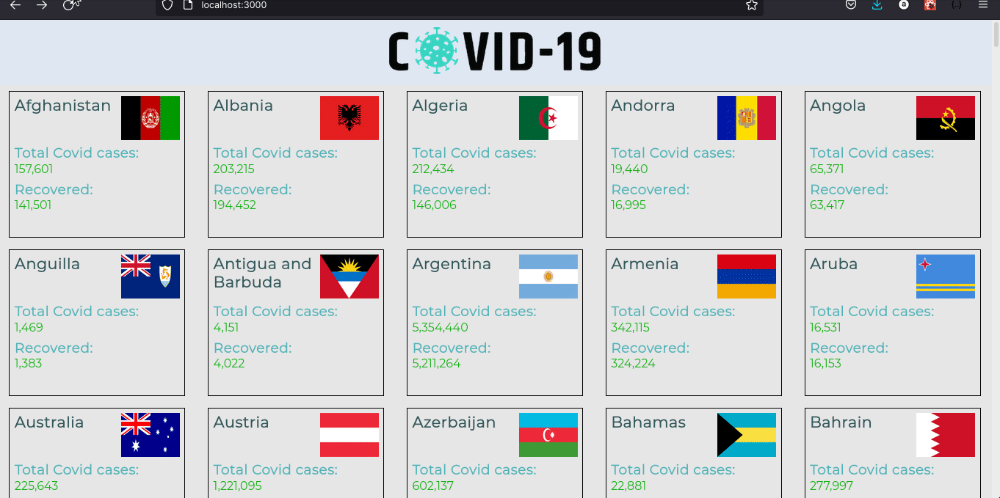

<p align="center">
  <a href="https://github.com/ixboy/countries-covid19-tracker">
    
  </a>
  <a href="https://github.com/ixboy/countries-covid19-tracker">
    
  </a>
  <a href="https://github.com/ixboy">
    
  </a>
</p>

# Covid-19 World Data Tracker

> In this App, I used The [Open Disease Data API](https://disease.sh/) to build a React/Redux app that shows you Coronavirus disease data (COVID-19) for almost all countries in the world, it shows new cases reported for each country today and the total amount of infected people, number of recovered people, number of deaths, country population, etc. The app is fully responsive to look good on all devices!.


screenshot



## 👷🏻 Built with

  - [React](https://reactjs.org/)
  - [Redux](https://redux.js.org/)
  - [Axios](https://github.com/axios/axios)
  - [CSS3](https://developer.mozilla.org/en-US/docs/Web/CSS)
  - [Material-UI](https://mui.com/)
  - [Open Disease Data API](https://disease.sh/)


## 🌐 Live Preview

> [Covid-19 World Data Tracker](https://61b414ffe5d4a6371df96249--covid19-worlddata.netlify.app/)


## 🚩 Getting Started
To get this project up and running, follow the steps bellow:

### 👨🏻‍🔧 Setup

- Clone the repository into your machine.
- Open your terminal and move to the root of the project, using ```$ cd``` command.
- Run ```$ yarn``` to install all dependencies.
- You must run ```$ yarn start``` to start live server
- Then your browser will run the App locally 


### ✅ Prerequisites
- Any modern web browser.
- Any source-code editor (VSCode recommended).
- npm, node and yarn installed


## 👨🏻‍💻 Iyunda Ismael Antonio

- GitHub: [@ixboy](https://github.com/ixboy)
- Twitter: [@ismaelixboy](https://twitter.com/ismaelixboy)
- LinkedIn: [ismael-antonio](https://www.linkedin.com/in/ismaelantonio/)


### 🤝🏻 Contributions and issues are welcome!

This project is [MIT](./README.md) licensed.
